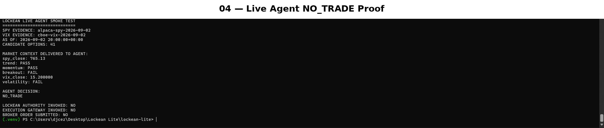
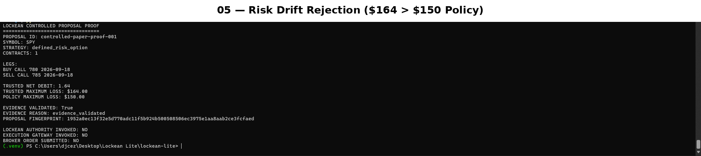
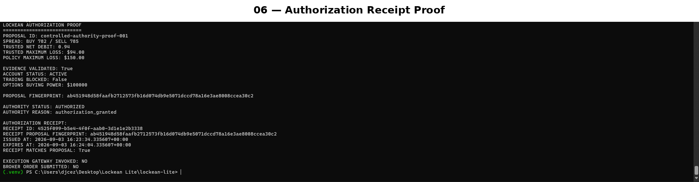
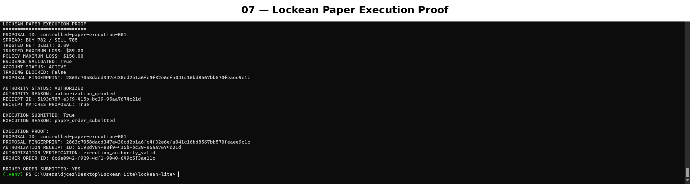
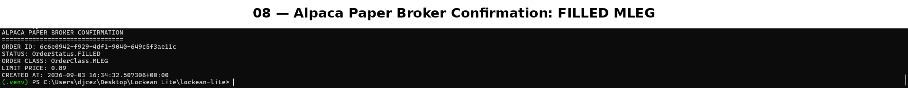

# Lockean Lite

**Independent authorization for autonomous AI trading agents.**

> **Autonomous judgment. Independent authority.**

Lockean Lite was built for the **Alpaca AI Trading Agents Hackathon** to answer one question:

**Who should have the authority to turn an AI trading decision into an action involving capital?**

The AI may analyze real market context and decide `TRADE` or `NO_TRADE`, but it cannot authorize itself and cannot reach the broker directly. A separate Lockean Authority validates trusted evidence, proposal integrity, defined risk, account eligibility, and policy. If authorized, it issues a short-lived cryptographic receipt bound to the exact proposal fingerprint. A separate Execution Gateway must verify that receipt before an Alpaca paper order can be submitted.

**No component can create, authorize, and execute a trade alone.**

---

## Final Hackathon Proof

Lockean Lite now has four complementary proof points:

| Proof | Result |
|---|---|
| **Autonomous AI judgment** | Real Alpaca SPY data + official Cboe VIX data + 41 real SPY option candidates reached the AI; the AI independently chose `NO_TRADE` |
| **Independent risk rejection** | Trusted repricing produced **$164 maximum loss** against a **$150 policy limit**; no broker order was submitted |
| **Independent authorization** | A compliant proposal received a signed, short-lived, proposal-bound Authorization Receipt while broker submission still remained `NO` |
| **Independent execution** | The Execution Gateway verified exact authority and Alpaca independently confirmed a real paper **MLEG order FILLED at $0.89** |

Final regression seal:

```text
197 passed
0 regressions
1 known third-party websockets deprecation warning
```

---

## Why Lockean Is Different

Lockean Lite is **not primarily an AI trading bot with risk rules attached**.

It is a separate authorization system for AI-generated financial actions.

A conventional design often collapses decision and permission into one process:

```text
AI proposes trade
      ↓
risk checks
      ↓
submit order
```

Lockean separates those powers:

```text
Real market evidence + trusted option candidates
                    ↓
              AI JUDGMENT
             TRADE / NO_TRADE
                    ↓
          structured recommendation
                    ↓
     trusted proposal construction + risk
                    ↓
            evidence validation
                    ↓
           paper-account evidence
                    ↓
          LOCKEAN AUTHORITY
                    ↓
     signed short-lived authorization
     bound to exact proposal fingerprint
                    ↓
          EXECUTION GATEWAY
       independently verifies receipt
                    ↓
          ALPACA PAPER TRADING
```

There is no AI → broker shortcut.

---

## Separation of Powers

### AI Agent — judgment only

The AI receives:

- real SPY daily evidence from Alpaca,
- official VIX daily evidence from Cboe,
- derived market context,
- real SPY option candidates,
- the configured maximum-loss policy as planning context.

It may decide:

- `TRADE`, with a structured SPY bull-call-spread recommendation, or
- `NO_TRADE`.

It does **not** provide trusted pricing, maximum-loss calculations, authorization, receipts, or broker instructions.

### Lockean Authority — permission only

Lockean independently verifies:

- supported strategy and proposal structure,
- contract quantity and option-leg integrity,
- trusted net debit and maximum loss,
- configured maximum-loss ceiling,
- paper-account status and trading-blocked state,
- options trading level and buying power,
- validated evidence bound to the exact proposal fingerprint.

If every authorization requirement is satisfied, Lockean issues a signed Authorization Receipt valid for only a short period and only for that exact proposal.

### Execution Gateway — broker access only

The Execution Gateway can reach Alpaca, but it cannot authorize a trade itself.

Immediately before submission it independently verifies:

- a receipt exists,
- the receipt signature is valid,
- the receipt is unexpired,
- the receipt fingerprint matches the exact proposal being executed.

Only then may an Alpaca paper MLEG limit order be submitted.

---

## Autonomous Read-Only Demo

The final judge-facing command uses real external boundaries but deliberately contains **no account-authority or broker-execution path**:

```powershell
python -m lockean_lite.live_agent_demo `
  --completed-through 2026-09-02 `
  --expiration 2026-09-18
```

The recorded September 2 run produced:

```text
LOCKEAN LIVE AGENT DEMO
=======================

SPY EVIDENCE: alpaca-spy-2026-09-02
VIX EVIDENCE: cboe-vix-2026-09-02
AS OF: 2026-09-02 20:00:00+00:00
CANDIDATE OPTIONS: 41

MARKET CONTEXT DELIVERED TO AGENT:
spy_close: 765.13
trend: PASS
momentum: PASS
breakout: FAIL
vix_close: 15.200000
volatility: FAIL

AGENT DECISION: NO_TRADE

LOCKEAN AUTHORITY INVOKED: NO
EXECUTION GATEWAY INVOKED: NO
BROKER ORDER SUBMITTED: NO
```

The failed context signals are information delivered to the AI; they are not a hidden deterministic pre-AI veto. The autonomous agent still receives the opportunity and decides whether it wants to trade.



---

## Independent Risk Rejection

An AI recommendation is only intent. Lockean reconstructs financially meaningful values from trusted option quotes.

During controlled proof, fresh pricing moved a candidate outside policy:

```text
TRUSTED MAXIMUM LOSS: $164.00
POLICY MAXIMUM LOSS:  $150.00
```

Result:

```text
REJECTED
BROKER ORDER SUBMITTED: NO
```

The earlier estimate was not preserved merely to force a demo.



---

## Proposal-Bound Authorization Receipt

A successful Lockean review does not merely return `approved = true`.

It creates a cryptographically authenticated Authorization Receipt containing authority over the **exact proposal fingerprint** for a short lifetime.

A controlled compliant SPY 782/785 bull call spread produced:

```text
TRUSTED MAXIMUM LOSS: $94.00
POLICY MAXIMUM LOSS:  $150.00

AUTHORITY STATUS: AUTHORIZED
RECEIPT MATCHES PROPOSAL: True
BROKER ORDER SUBMITTED: NO
```

That last line is deliberate: **authorization is not execution**.



Changing financially meaningful proposal data after authorization invalidates execution, including changes to quantity, strikes, expiration, legs, or net debit. Missing, forged, expired, or proposal-mismatched receipts fail closed.

---

## Real Alpaca Paper Execution Proof

The separate Execution Gateway received an authorized controlled proposal and independently verified its receipt before touching Alpaca.

The execution proof reported:

```text
AUTHORITY STATUS: AUTHORIZED
RECEIPT MATCHES PROPOSAL: True
AUTHORIZATION VERIFICATION: execution_authority_valid
EXECUTION SUBMITTED: True
BROKER ORDER SUBMITTED: YES
```



Alpaca independently confirmed the resulting broker order:

```text
STATUS: FILLED
ORDER CLASS: MLEG
LIMIT PRICE: 0.89
```



This was a real **paper-trading** multi-leg order. Lockean Lite does not enable live-money execution for the hackathon demo.

---

## Evidence and Market Context

The current vertical slice is intentionally narrow: **SPY defined-risk bull call spreads**.

| Evidence | Source |
|---|---|
| SPY daily market data | Alpaca Market Data |
| VIX daily history | Official Cboe history |
| SPY option contracts and quotes | Alpaca Options APIs |
| Paper-account eligibility | Official Alpaca CLI, read-only account query |

The shared context supplied to the autonomous agent includes:

- bullish trend: `close > SMA50 > SMA200`
- momentum: `50 < RSI(14) < 70`
- breakout: close above the previous 20-session high
- volatility: VIX below its 20-session average

Evidence authorization is a different responsibility. It verifies supported source, symbol, aligned `as_of`, completed-bar consistency, and proposal fingerprint binding. Market-context interpretation is not silently reintroduced as an authority veto.

---

## Paper Account Verification

Production account evidence is sourced with the official Alpaca CLI in read-only mode:

```text
alpaca api GET /v2/account --quiet
```

The adapter strictly validates the response and rejects:

- unavailable CLI,
- timeouts,
- nonzero return codes,
- malformed JSON,
- missing or invalid required fields,
- any environment configuration opting into Alpaca live trading.

Normalized fields used by Lockean Authority include account status, trading-blocked state, options trading level, and options buying power.

Broker rejection is not used as the primary risk-control mechanism. Lockean attempts to reject unauthorized proposals **before** they reach Alpaca.

---

## Defined-Risk Contract

A valid proposal requires:

- strategy `defined_risk_option`,
- exactly two call legs,
- one buy and one sell,
- matching expiration,
- buy strike below sell strike,
- positive net debit,
- positive contract quantity.

Lockean independently derives:

```text
maximum loss = net debit × 100 × contracts
```

Hackathon policy ceiling:

```text
$150 maximum allowed loss
```

The AI may see that ceiling as recommendation context, but only Lockean can decide whether the trusted proposal complies with it.

---

## Core Safety Invariants

1. **The AI cannot submit broker orders.**
2. **The AI cannot authorize its own recommendation.**
3. **The AI may autonomously choose `TRADE` or `NO_TRADE`.**
4. **Trusted pricing and maximum loss are derived independently of the AI.**
5. **Market evidence must come from supported external sources.**
6. **Validated evidence is bound to the exact proposal fingerprint.**
7. **Authorization is cryptographically authenticated and short-lived.**
8. **Tampering after authorization fails closed.**
9. **The Execution Gateway independently re-verifies authority.**
10. **Invalid authority prevents downstream broker interaction.**
11. **Presentation layers cannot authorize, mint receipts, or execute trades.**
12. **Policy is not weakened merely to manufacture a successful demonstration.**

---

## Technology

- Python
- OpenAI Responses API with strict structured recommendation schema
- Alpaca Market Data
- Alpaca Options APIs
- Alpaca Paper Trading
- Alpaca CLI read-only account evidence
- Official Cboe VIX history
- HMAC-SHA256 authenticated Authorization Receipts
- immutable proposal fingerprints
- Alpaca MLEG DAY limit orders
- pytest contract and integration suite

---

## Install and Test

```powershell
git clone https://github.com/Djcezile/Lockean-lite.git
cd Lockean-lite
python -m venv .venv
.\.venv\Scripts\Activate.ps1
python -m pip install -e ".[dev]"
python -m pytest -q
```

Current verified state:

```text
197 passed
0 regressions
1 known third-party websockets deprecation warning
```

The warning originates from an external dependency and does not fail the suite.

---

## Public Read-Only Control Room

**Demo:** https://djcezile.github.io/Lockean-lite/

The public interface is intentionally presentation-only. It cannot authorize a proposal, issue an Authorization Receipt, call the Execution Gateway, or submit a broker order.

**Source:** https://github.com/Djcezile/Lockean-lite

---

## Scope

Lockean Lite deliberately proves one vertical slice instead of pretending to be a complete hedge fund platform.

The competition thesis is the architecture itself:

> **Powerful AI can make autonomous financial judgments without being trusted with unilateral execution authority.**

Other systems may focus on making the AI a better trader. Lockean Lite focuses on ensuring that even a powerful trader is **not its own authority**.

---

## Disclaimer

Lockean Lite is a hackathon prototype operating against **Alpaca paper trading**. It is not financial advice and is not presented as a production-ready live trading system.
