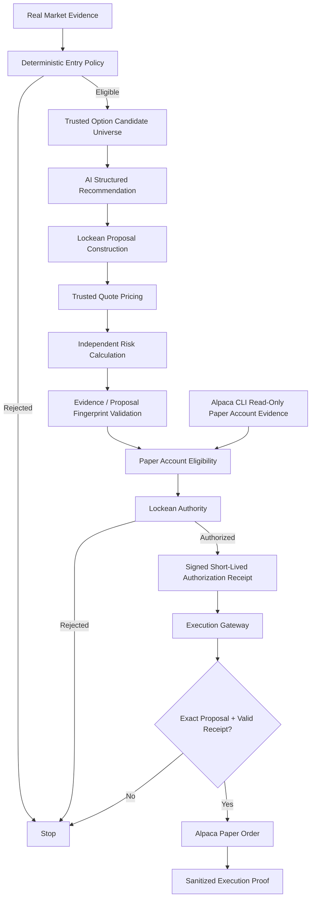
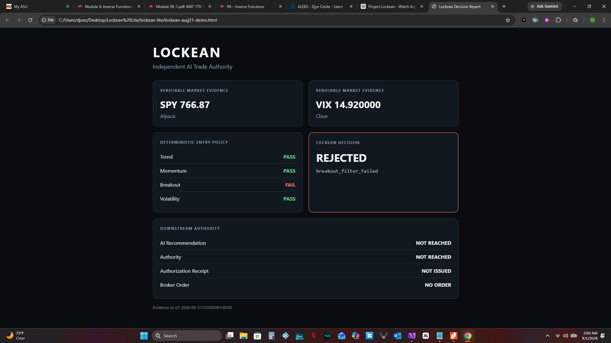

# Lockean Lite

**Independent execution authority for autonomous AI trading agents.**

> AI proposes. Lockean verifies. Authority decides. Only then may software act.

Lockean Lite is a deterministic execution-control system built for the **Alpaca AI Trading Agents Hackathon**.

The central idea is simple:

**An AI trading agent should not be able to authorize its own trades.**

The AI may recommend a trade, but it has no direct broker execution authority. Before an order can reach Alpaca, an independent Lockean Authority verifies the market evidence, proposal integrity, defined risk, account eligibility, and execution permission.

If any requirement fails, the system fails closed.

---

## The Problem

AI trading agents can reason about markets and generate trade ideas, but allowing the same AI to both:

1. propose a trade, and
2. execute that trade

creates a dangerous concentration of authority.

A hallucination, malformed proposal, stale observation, altered quantity, excessive risk, or compromised agent could otherwise become a broker order.

Lockean separates those responsibilities.

```text
AI
│
│ structured recommendation only
▼
Lockean
│
│ independently verified proposal
▼
Lockean Authority
│
│ signed, short-lived authorization
▼
Execution Gateway
│
│ exact receipt + exact proposal required
▼
Alpaca Paper Trading
```

The AI cannot bypass this chain.

---

## Competition Thesis

Lockean Lite is **not primarily an AI trading bot with risk rules attached**.

It is an independent execution authority for AI-generated financial actions.

### The AI may

- analyze the available option candidates,
- recommend an expiration,
- recommend a buy strike,
- recommend a sell strike,
- recommend a contract quantity.

### The AI may not

- decide whether market-entry policy passed,
- determine trusted option prices,
- determine maximum loss,
- declare itself policy-compliant,
- authorize execution,
- create an Authorization Receipt,
- submit a broker order.

Those responsibilities belong to Lockean.

---

## Architecture



There is no AI → broker shortcut.

Paper-account evidence enters through the official Alpaca CLI in read-only mode. Lockean calls `alpaca api GET /v2/account --quiet`, strictly validates the response, and normalizes only the account fields required by Lockean Authority. The CLI cannot issue Authorization Receipts or submit broker orders.

---

## Fail-Closed Execution Authority

Authorization Receipts are:

- generated only by Lockean Authority,
- cryptographically authenticated,
- short-lived,
- bound to the exact proposal fingerprint.

The Execution Gateway independently verifies the receipt immediately before broker interaction.

Changing financially meaningful proposal data after authorization invalidates execution.

Examples include changes to:

- contract quantity,
- strikes,
- expiration,
- legs,
- net debit,
- other fingerprint-bound proposal fields.

A missing, forged, expired, or proposal-mismatched receipt prevents broker execution.

---

## Real Market Evidence

The current vertical slice evaluates **SPY defined-risk call spreads**.

Lockean consumes independently sourced market evidence:

| Evidence | Source |
|---|---|
| SPY daily market data | Alpaca |
| VIX daily history | Official Cboe data |

The AI does not supply indicator conclusions.

Lockean independently evaluates:

- bullish trend: `close > SMA50 > SMA200`
- momentum: `50 < RSI(14) < 70`
- breakout: close above the previous 20-session high
- volatility: VIX below its 20-session average

Incomplete or mismatched evidence fails closed.

---

## Real Rejection Proof

Lockean has already been exercised against real completed market data.

For the completed **August 31, 2026** session:

```text
SPY / Alpaca: 766.87
VIX / Cboe:   14.920000

Trend:      PASS
Momentum:   PASS
Breakout:   FAIL
Volatility: PASS
```

Lockean returned:

```text
DECISION: REJECTED
REASON: breakout_filter_failed

AI RECOMMENDATION REACHED: NO
AUTHORITY REACHED: NO
AUTHORIZATION RECEIPT ISSUED: NO
BROKER ORDER SUBMITTED: NO
```

No threshold was changed to force a successful result.

That behavior is intentional.

If real market evidence does not satisfy Lockean policy, the system does not trade.

### Latest completed-session check

For the completed **September 2, 2026** session:

```text
SPY / Alpaca: 765.13
VIX / Cboe:   15.200000

Trend:      PASS
Momentum:   PASS
Breakout:   FAIL
Volatility: FAIL

DECISION: REJECTED
REASON: breakout_filter_failed

AI RECOMMENDATION REACHED: NO
AUTHORITY REACHED: NO
AUTHORIZATION RECEIPT ISSUED: NO
BROKER ORDER SUBMITTED: NO
```

Again, no threshold was changed in response to the real-market rejection.

---

### Real rejection dashboard



Additional evidence:

- [Real rejection terminal output](docs/demo_evidence/01_real_rejection_terminal.png)
- [Clean-checkout 163-test verification](docs/demo_evidence/03_clean_checkout_tests.png)

## Judge-Facing Read-Only Demo

The real-market rejection path can be reproduced with one command:

```powershell
python -m lockean_lite.market_evidence_cli `
  --completed-through 2026-08-31
```

This command is **read-only**.

It has no:

- AI execution capability,
- Lockean Authority,
- Authorization Receipt issuance,
- Execution Gateway,
- `submit_order()` path.

It can observe and explain.

It cannot execute.

---

## Online Read-Only Prototype

The public static prototype is available at:

https://djcezile.github.io/Lockean-lite/

The page displays Lockean evidence and decisions only. It has no Authority, no receipt issuance, no Execution Gateway, and no broker-order path.

---

## Browser Dashboard

The same immutable Lockean decision can be rendered as a browser-viewable report:

```powershell
python -m lockean_lite.market_evidence_cli `
  --completed-through 2026-08-31 `
  --format html `
  --output .\lockean-demo.html
```

Then:

```powershell
Start-Process .\lockean-demo.html
```

The visual layer does not recalculate indicators or reinterpret decisions.

**Lockean decides. The interface displays.**

---

## Successful Execution Proof

The production execution path is already implemented behind the complete authorization chain.

When a real market session legitimately qualifies and the complete proposal passes Lockean verification, the result can carry sanitized execution proof containing:

- proposal ID,
- proposal fingerprint,
- Authorization Receipt ID,
- execution-authority verification result,
- Alpaca paper broker order ID.

The proof deliberately excludes:

- Authority signing keys,
- Authority signatures,
- the complete signed Authorization Receipt,
- raw Alpaca broker objects.

The execution-capable artifacts remain inside the Lockean Authority / Execution Gateway boundary.

### Current status

A genuine evidence-backed Alpaca paper execution remains an open real-market acceptance criterion.

Lockean will not manufacture a qualifying market signal or weaken policy simply to produce a successful demo.

---

## Defined-Risk Vertical Slice

Lockean Lite intentionally implements one narrow trading strategy:

**SPY bull call spread**

A valid proposal requires:

- strategy: `defined_risk_option`
- exactly two call legs,
- one buy and one sell,
- matching expiration,
- buy strike below sell strike,
- positive net debit,
- positive contract quantity.

Lockean independently derives:

```text
maximum loss = net debit × 100 × contracts
```

The current policy ceiling is:

```text
$150 maximum allowed loss
```

The AI may know this limit as planning context, but Lockean independently determines whether the resulting proposal complies with it.

---

## Paper Account Verification

Production paper-account evidence is sourced through the official Alpaca CLI using the read-only raw account command:

```text
alpaca api GET /v2/account --quiet
```

The adapter rejects missing CLI availability, timeouts, nonzero exit codes, malformed JSON, missing required fields, invalid field types, and any environment configuration that opts into Alpaca live trading.

Before authorization, Lockean independently checks normalized Alpaca paper-account evidence including:

- account status,
- trading-blocked state,
- effective options trading level,
- options buying power.

Broker rejection is not used as the primary risk-control mechanism.

Lockean attempts to reject invalid proposals **before** they reach Alpaca.

---

## Example AI Boundary

The AI recommendation contract contains only structured trade intent:

```json
{
  "symbol": "SPY",
  "expiration": "2026-09-18",
  "buy_strike": 775,
  "sell_strike": 780,
  "contracts": 1
}
```

The AI does **not** supply:

```text
net_debit
maximum_loss
market_verdict
authorization
receipt
broker_order
```

Lockean constructs those financial and authority decisions independently.

---

## Example Independent Risk Rejection

During a real Alpaca + OpenAI probe, the AI recommended:

```text
BUY  SPY 2026-09-18 775 Call
SELL SPY 2026-09-18 780 Call
1 contract
```

Using trusted Alpaca quotes, Lockean independently derived:

```text
Net debit:    $2.13
Maximum loss: $213.00
Policy limit: $150.00
```

The recommendation therefore could not proceed under the configured risk policy.

The AI did not get to decide that it was compliant.

---

## Execution Sequence

A real successful execution must traverse this exact sequence:

```text
Real qualifying market evidence
        ↓
AI structured recommendation
        ↓
Lockean exact-quote proposal construction
        ↓
Lockean risk calculation
        ↓
Evidence bound to proposal fingerprint
        ↓
Paper account eligibility
        ↓
Lockean Authority
        ↓
Signed Authorization Receipt
        ↓
Execution Gateway independently verifies receipt
        ↓
Exact Alpaca MLEG DAY limit order
        ↓
Alpaca paper submit_order()
        ↓
Broker order ID
        ↓
Sanitized ExecutionProof
```

There is no alternate demo execution path.

---

## Why Limit Orders?

The current options execution adapter builds an Alpaca multi-leg (`MLEG`) DAY **limit order**.

A market order could fill above the debit Lockean actually authorized.

The broker request therefore preserves the authorized debit constraint rather than allowing execution price to float without bound.

---

## Security Boundaries

Runtime secrets are supplied through environment variables and are not committed to source control.

Required runtime credentials include:

```text
ALPACA_API_KEY
ALPACA_SECRET_KEY
OPENAI_API_KEY
LOCKEAN_AUTHORIZATION_SIGNING_KEY
```

The Authority signing key is supplied only to:

- Lockean Authority
- Execution Gateway

It is never supplied to the AI recommendation provider.

---

## Installation

Clone the repository:

```powershell
git clone https://github.com/Djcezile/Lockean-lite.git
cd lockean-lite
```

Create and activate a virtual environment:

```powershell
python -m venv .venv
.\.venv\Scripts\Activate.ps1
```

Install the project:

```powershell
python -m pip install -e .
```
For development or to run the test suite, install the optional development dependencies:

```powershell
python -m pip install -e ".[dev]"
```

### Alpaca CLI prerequisite for the production runtime

The execution-capable production runtime requires the official Alpaca CLI to be installed and available on `PATH`.

Lockean Lite was acceptance-tested with:

```text
Alpaca CLI 0.0.14
```

Verify installation with:

```powershell
alpaca version
```

The normal pytest suite does not require access to a real broker account because the CLI subprocess boundary is tested with deterministic fakes.

## Tests

Run the complete test suite:

```powershell
python -m pytest -q
```

Current verified repository state:

```text
178 passed
0 regressions
1 known third-party websockets deprecation warning
```

The remaining warning originates from an external dependency and does not fail the suite.

---

## Core Safety Invariants

Lockean Lite is built around several non-negotiable properties:

1. **The AI cannot submit broker orders.**
2. **The AI cannot authorize its own recommendation.**
3. **Market evidence must come from supported external sources.**
4. **Lockean independently calculates financially meaningful values.**
5. **Authorization is bound to the exact proposal fingerprint.**
6. **Authorization expires.**
7. **Tampering after authorization fails closed.**
8. **The Execution Gateway independently verifies authority.**
9. **Invalid authority prevents downstream broker interaction.**
10. **Presentation layers cannot authorize or execute trades.**
11. **A broker transaction result is never rewritten because a later presentation step failed.**
12. **No policy is weakened merely to manufacture a successful demonstration.**

---

## Technology

Lockean Lite currently integrates:

- Python
- Alpaca Paper Trading
- Alpaca Market Data
- Alpaca Options APIs
- Alpaca CLI for read-only paper-account evidence
- OpenAI Responses API
- Official Cboe VIX history
- deterministic policy evaluation
- HMAC-SHA256 authenticated Authorization Receipts
- immutable proposal fingerprints
- pytest-based contract and integration tests

---

## Project Scope

Lockean Lite is intentionally narrow.

The hackathon build demonstrates the architecture through one defined-risk options vertical slice rather than attempting to become a general-purpose trading platform.

The purpose is to prove the control model:

> **Powerful AI can recommend financial actions without being trusted with unilateral execution authority.**

---

## Status

**Active hackathon development.**

Completed:

- deterministic market-entry policy
- independent market-evidence validation
- proposal fingerprinting
- independent risk calculation
- paper-account eligibility checks
- official Alpaca CLI read-only account-evidence adapter
- Lockean Authority
- signed short-lived Authorization Receipts
- independent Execution Gateway
- real Alpaca option-contract resolution
- real broker-facing multi-leg order construction
- structured OpenAI recommendation boundary
- production autonomous runtime
- real externally sourced rejection demonstration
- judge-facing text and browser reports
- sanitized successful-execution proof propagation
- read-only execution-proof visualization

Pending real-market acceptance criterion:

- first genuine qualifying evidence-backed Alpaca paper order through the complete production authority chain

---

## Disclaimer

Lockean Lite is a hackathon prototype operating against **Alpaca paper trading**.

It is not presented as financial advice or as a production-ready live trading system.
