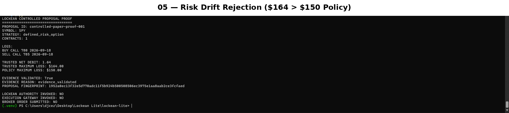
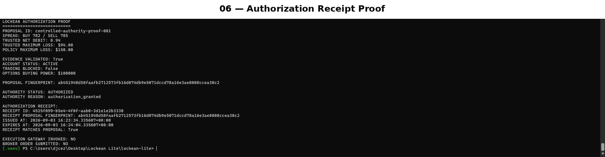
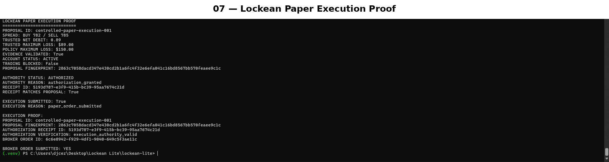
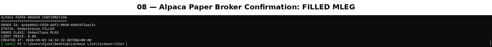

# Lockean Lite

**Profit is the proof. Everything else must earn its place.**

Lockean Lite exists to maximize **durable net profitability** in Alpaca paper
trading. Every component must create profit, preserve profit, scale profit, or
prove profit. Architecture, safety, and presentation are supporting systems,
not substitutes for positive net P&L.

The permanent authority boundary remains non-negotiable:

Lockean Lite was built for the **Alpaca AI Trading Agents Hackathon** around one question:

> **Who should have the authority to turn an AI trading decision into an action involving capital?**

The AI may analyze the market and decide `TRADE` or `NO_TRADE`, but it cannot authorize itself and cannot reach the broker directly. A separate Lockean Authority validates trusted evidence, proposal integrity, defined risk, account eligibility, and policy. If authorized, it issues a short-lived cryptographically authenticated receipt bound to the exact proposal fingerprint. A separate Execution Gateway must verify that receipt before an Alpaca paper order can be submitted.

**No component can create, authorize, and execute a trade alone.**

## Product Objective

The primary score is all-in net P&L after losses, execution friction, and
operating costs. Alpaca provides the broker-grounded trading result; until AI
and infrastructure expense is measured, Lockean explicitly reports all-in net
P&L as unknown. Trade count, AI activity, test count, and presentation quality
are not business outcomes.

The normal launcher now uses `profit_first` mode:

- never trade merely to exercise the lifecycle or fill a log;
- prefer cash when evidence is incomplete, mixed, stale, or economically weak;
- reject failed hard market prerequisites before option discovery or external
  AI inference;
- admit only the first explicit strategy hypothesis: a SPY bull-call debit
  spread with aligned daily trend, momentum, breakout, and volatility evidence;
- require current-session, 15-minute, and 30-minute upside alignment;
- require at least **1.50:1** maximum reward-to-risk after estimated round-trip
  costs, using trusted quote-derived debit rather than AI-supplied pricing;
- end new-entry authority after the first confirmed session stop; and
- publish an end-of-session broker scorecard while explicitly identifying
  untracked operating costs and unknown all-in net P&L.

This is a selective **experimental strategy contract**, not a profitability
claim. Live-capital authority remains disabled until a strategy earns promotion
through positive out-of-sample paper evidence.

## Live Demo

- **Live Alpaca Paper Control Room:** https://lockean-lite.streamlit.app/
- **Static architecture / proof site:** https://djcezile.github.io/Lockean-lite/
- **Source:** https://github.com/Djcezile/Lockean-lite

The Streamlit Control Room is read-only. It refreshes from the same Alpaca paper account the autonomous session trades and displays live equity, total P&L, day P&L, unrealized P&L, cash, buying power, options buying power, open option positions, managed-spread capacity, recent broker orders, and Alpaca's market clock.

---

## Architecture

```text
       Alpaca market data + Cboe VIX
                            ↓
          PROFIT-FIRST MARKET PREFLIGHT
                     eligible only
                            ↓
             real SPY option candidates
                            ↓
                      AI JUDGMENT
                     TRADE / NO_TRADE
                            ↓
                structured recommendation
                            ↓
          trusted proposal reconstruction + risk
                            ↓
                 evidence / account checks
                            ↓
                   LOCKEAN AUTHORITY
                            ↓
          signed short-lived Authorization Receipt
              bound to exact proposal fingerprint
                            ↓
                  EXECUTION GATEWAY
          independently re-verifies authority
                            ↓
                    ALPACA PAPER
                            ↓
             positions / equity / P&L / orders
                            ↓
              READ-ONLY CONTROL ROOM
```

There is no AI → broker shortcut.

### AI Agent — judgment only

The AI receives real SPY market evidence, official VIX history, derived market context, supplied SPY option candidates, and planning constraints. It may return a structured defined-risk bull-call-spread recommendation or `NO_TRADE`.

It does **not** provide trusted pricing, maximum-loss calculations, authorization, receipts, or broker instructions.

### Lockean Authority — permission only

Lockean independently validates proposal structure, trusted net debit and maximum loss, evidence identity and time consistency, paper-account state, options level, buying power, policy, and exact proposal fingerprint binding.

Authorization produces a **signed, short-lived Authorization Receipt** rather than a Boolean approval.

### Execution Gateway — broker access only

The Gateway can reach Alpaca, but it cannot authorize itself. Immediately before submission it independently verifies receipt existence, signature, expiry, and exact proposal match.

Only then can an Alpaca paper MLEG order be submitted.

### Control Room — observation only

The dashboard reads Alpaca account state, positions, orders, P&L and clock. It does not import the autonomous trading loop, mint Authorization Receipts, or submit orders.

---

## Autonomous Paper Session

Lockean Lite now runs continuously from one command against the linked Alpaca
paper account. The launcher creates the repository `logs` directory when
needed, mirrors the session to the terminal, and writes a line-buffered record
to `logs/lockean_lite_DAY<N>_<timestamp>.log`.

```powershell
python -m lockean_lite.session_launcher `
  --day-number 21 `
  --completed-through 2026-10-05 `
  --expiration 2026-10-09
```

The launcher owns the approved profit-first arguments so the terminal command
cannot silently omit a safety control. Local log contents remain excluded from
Git by `.gitignore`.

Current session controls:

- Alpaca **paper-only** trading client
- `profit_first` judgment with no activity-generation bias
- maximum **1 committed spread unit**
- pending MLEG orders count toward capacity
- each new autonomous recommendation is constrained to **1 spread unit**
- **$150** maximum allowed loss per proposal
- **$150** daily-loss halt for new entries
- **30%** take-profit target and **20%** stop-loss threshold
- first confirmed stop-loss fill disables all later entries for the session
- each confirmed stop also reduces the maximum committed spread capacity by
  one; with a one-stop limit, the first stop leaves zero entry capacity
- the remaining-capacity gate prevents already-authorized concurrent exposure
  from producing more stopped spread units than the configured session limit
- entry eligibility runs no more often than every **15 minutes**; AI is called
  only after deterministic market eligibility, with a **30-minute**
  post-submission cooldown
- a failed completed-session trend, momentum, breakout, or volatility check is
  latched for the run because that evidence cannot change intraday; 30-second
  portfolio, pending-order, and exit monitoring continues
- the closing scorecard reports AI inference requests separately from entry
  evaluations so avoidable operating work remains visible
- every loop emits a UTC heartbeat so an interrupted run has a defensible
  last-known observation time
- each log records run parameters and a terminal completion, interruption, or
  sanitized fatal-error marker; absence of that marker identifies abrupt host
  or process loss
- no new position may be opened during the final **30 minutes** of the session
- stop-loss state is rebuilt from tagged closed Alpaca orders after a restart;
  submissions, stale cancellations, and take-profit fills do not count
- Alpaca market-clock awareness
- temporary Alpaca / AI / market-data failures fail closed for that iteration and reconcile next cycle
- session continues monitoring even when new entries are blocked
- completed sessions print opening equity, closing equity, net equity change,
  broker day P&L, evaluation count, broker outcome, and the explicit limitation
  that operating costs and all-in net P&L are not yet tracked

The runner does not simulate P&L. Orders are submitted to Alpaca paper trading, and subsequent account equity, positions and P&L are read back from Alpaca.

---

## Final Hackathon Proof

| Proof | Result |
|---|---|
| **Autonomous AI judgment** | Real Alpaca SPY data + official Cboe VIX + 41 real SPY option candidates reached the AI; it independently chose `NO_TRADE` |
| **Independent risk rejection** | Trusted repricing produced **$164 maximum loss** against a **$150 policy limit**; no broker order was submitted |
| **Independent authorization** | A compliant proposal received a signed short-lived proposal-bound Authorization Receipt while broker submission still remained `NO` |
| **Independent execution** | The Gateway verified exact authority and Alpaca independently confirmed a real paper **MLEG order FILLED at $0.89** |
| **Live portfolio telemetry** | The same Alpaca paper account feeds positions, orders, equity and P&L into the public Control Room |
| **Persistent autonomy** | A market-clock-aware session runner repeats autonomous evaluation cycles while portfolio and loss limits remain satisfied |

### Risk drift rejection

```text
TRUSTED MAXIMUM LOSS: $164.00
POLICY MAXIMUM LOSS:  $150.00
BROKER ORDER SUBMITTED: NO
```



### Proposal-bound authorization

```text
AUTHORITY STATUS: AUTHORIZED
RECEIPT MATCHES PROPOSAL: True
BROKER ORDER SUBMITTED: NO
```



### Real Alpaca paper fill

```text
AUTHORIZATION VERIFICATION: execution_authority_valid
EXECUTION SUBMITTED: True
BROKER ORDER SUBMITTED: YES
```



Alpaca independently confirmed:

```text
STATUS: FILLED
ORDER CLASS: MLEG
LIMIT PRICE: 0.89
```



---

## Defined-Risk Contract

The hackathon vertical slice is intentionally narrow: **SPY bull call spreads**.

A valid proposal requires:

- strategy `defined_risk_option`
- exactly two call legs
- one buy and one sell
- matching expiration
- buy strike below sell strike
- positive trusted net debit
- positive contract quantity

Lockean derives:

```text
maximum loss = trusted net debit × 100 × contracts
```

Current per-proposal policy ceiling:

```text
$150 maximum allowed loss
```

The AI may see that ceiling as planning context, but only Lockean can determine whether trusted proposal facts comply with policy.

---

## Safety Invariants

1. The AI cannot submit broker orders.
2. The AI cannot authorize its own recommendation.
3. The AI may autonomously choose `TRADE` or `NO_TRADE`.
4. Trusted pricing and maximum loss are derived independently of the AI.
5. Validated evidence is bound to the exact proposal fingerprint.
6. Authorization is cryptographically authenticated and short-lived.
7. Tampering after authorization fails closed.
8. The Execution Gateway independently re-verifies authority.
9. Invalid authority prevents downstream broker interaction.
10. Pending broker orders consume portfolio capacity.
11. The autonomous session stops adding exposure at configured position and daily-loss limits.
12. The public dashboard is observation-only and cannot authorize or execute.
13. Alpaca paper state is the source of truth for fills, positions, equity and P&L.

---

## Technology

- Python
- OpenAI Responses API with strict structured recommendation schema
- Alpaca Market Data
- Alpaca Options APIs
- Alpaca Paper Trading
- Alpaca account / positions / orders / clock APIs
- official Cboe VIX history
- HMAC-SHA256 authenticated Authorization Receipts
- immutable proposal fingerprints
- Alpaca MLEG DAY limit orders
- Streamlit live read-only telemetry dashboard
- pytest contract and integration suite

---

## Install and Test

```powershell
git clone https://github.com/Djcezile/Lockean-lite.git
cd Lockean-lite
python -m venv .venv
.\.venv\Scripts\Activate.ps1
python -m pip install -r requirements.txt
python -m pip install -e ".[dev]"
python -m pytest -q
```

Current verified engineering seal:

```text
373 passed
0 regressions
```

---

## Scope

Lockean Lite is an experimental profitability research and autonomous execution
prototype operating against **Alpaca paper trading only**. It currently tests
one defined-risk SPY options vertical slice rather than claiming to be a
complete production portfolio platform or a profitable strategy.

Its central thesis is:

> **Powerful AI can make autonomous financial judgments and trade continuously without being trusted with unilateral execution authority.**

## Disclaimer

Lockean Lite is a paper-trading research prototype. It is not financial advice,
does not guarantee profit, and is not presented as a production-ready
live-money trading system.
